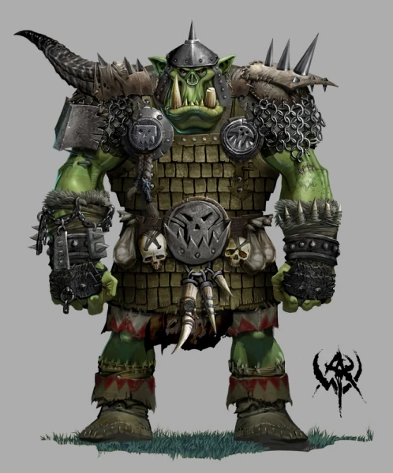

# Victor Silva Afonso
## CPE-322 Repository
### Spring 2025

My major is **Computer Engineering**

I hope to have a concentration in *Artificial Intelligence*

> My top songs in 2024 were

1. *Dumbest Girl Alive* by 100 Gecs
2. *Making the Band* by Earl Sweatshirt
3. *Black Rum* by Cake Pop

> Some of my hobbies include

- Gaming
- Reading
- Drawing

`while hunger = 0:
	eatfood()
	hunger += 1`

---

[Here is my team's project site.](https://sites.google.com/stevens.edu/cpe-322-group-2?usp=sharing)

